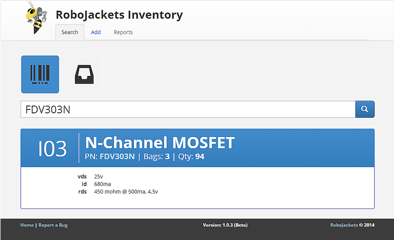

#RoboJackets Part Management
This tool is used by the RoboCup Electrical subteam to document part information and location.

##Installation

####Dependencies
* Apache
* PHP
* MySQL
* Slim Framework (included with source)

####Configuration
1. Download all files into the document root of your Apache instance
2. Copy the config.php.example file and rename it config.php
3. Edit the database configuration within the config.php file you just made
4. Import the database schema into mySQL*

*Database schema file will be posted once the final schema is decided upon

####Barcodes
While any barcode can be used for this inventory system, the barcode protocol of choice by the RoboJackets is [UPC-E](http://en.wikipedia.org/wiki/Universal_Product_Code). It is a one-dimensional barcode formatted as 6 data digits followed by 1 check digit. Valid characters for the UPC-E protocol are numbers 0 through 9. Both of these characteristics provide exactly 1 million unique barcodes for use.
